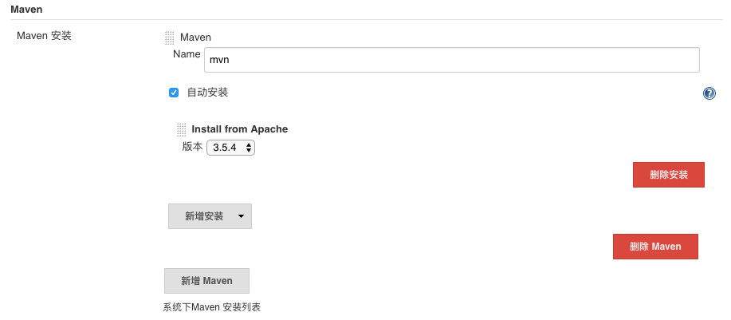

# Jenkins

## 基本概念

Jenkins是一个自动化服务器软件，可以使项目构建、部署自动化，免去手动构建的麻烦，在一个持续集成的环境中，自动构建和部署是重要的一环。

利用Jenkins，你可以集成源码控制、自动构建和自动部署，构成一条流水线。具体说来，当源码有新的提交，可以触发Jenkins构建，构建完成，自动部署到开发环境或生产环境，使互联网项目的快速迭代成为可能。

## 插件

Jenkins原生支持Java项目的构建，并通过插件来支持不同类型项目的构建，例如nodejs，有`Nodejs Plugin`，docker有`Docker Plugin`，Kubernetes有`Kubernetes Plugin`。

## 运行 Windows Batch

其实跟通过ssh运行shell一样，语法不同，参考 <https://en.wikibooks.org/wiki/Windows_Batch_Scripting>

如果要使用Power Shell，注意`C:\windows\system32`要在环境变量中。

## 安装psql

基于Debian的jenkins镜像需要用到psql：

```sh
docker exec -it -u root jenkins sh
apt-get update
apt-get install postgresql-client
```

## 安装docker

So called 'docker in docker'！

可以通过在jenkins控制台界面中`配置全局工具`中配置安装，也可以进入jenkins容器中安装docker。如下为在jenkins容器中安装：

```sh
docker exec -it -u root jenkins sh
apt-get install \
     apt-transport-https \
     ca-certificates \
     curl \
     gnupg2 \
     software-properties-common
curl -fsSL https://download.docker.com/linux/debian/gpg | apt-key add -
apt-key fingerprint 0EBFCD88
add-apt-repository \
   "deb [arch=amd64] https://download.docker.com/linux/debian \
   $(lsb_release -cs) \
   stable"
apt-get update
apt-get install docker-ce
```

## 配置maven

因为jenkins本身就依赖于Java环境，所以安装maven不需要安装Java环境。安装maven同docker一样，既可以在控制台`配置全局工具`中配置安装，也可以在jenkins容器中安装。在控制台安装截图如下：

