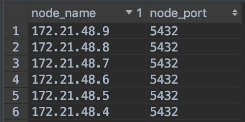

# PostgreSQL 利用 citus 支持地理大数据

PostgreSQL有一些极限：

```txt
Maximum size for a database? unlimited (32 TB databases exist)
Maximum size for a table? 32 TB
Maximum size for a row? 400 GB
Maximum size for a field? 1 GB
Maximum number of rows in a table? unlimited
Maximum number of columns in a table? 250-1600 depending on column types
Maximum number of indexes on a table? unlimited
```

使用单节点的PostgreSQL很多情况下是OK的，但32T的表放在一个机器节点上，查找一条记录，扫描一遍索引就要耗时很久。一般的做法是水平和垂直分表，手动分表对应用的侵入性较大，往往需要维护访问逻辑。今天介绍的Citus就可以不用更改应用逻辑，无痛迁移，还能带来并行计算的bouns，有人可能会说，PostgreSQL9.6就加入了并行执行，但日常处理地理数据，就少不了PostGIS，而PostgreSQL的并行执行对涉及PostGIS的查询就不行了（使用explain查询执行计划即可看出），而Citus却能充分调动所有资源并行执行。

同等CPU和RAM，原来单节点CPU和RAM等于worker的总和，集群相对于原来一般会有2~3倍的性能提升。主要原因是分表提升了资源利用率，并且索引更小。

## Citus是什么

`Citus`是一个PostgreSQL扩展，主要用于水平自动分表，有一个类似扩展`pg_shard`已是deprecation状态，推荐使用Citus。Citus是单coordinator，多worker架构，coordinator统筹协调工作，worker是真正干活的。支持分布式冗余存储，并行查询计算。

三个主要使用场景：

- 数据分布式存储的应用（`Multi-tenant Application`），实测单节点vs四台citus集群入库20G数据有7倍的差距；
- 实时分析（`Real-Time Dashboards`），只适合节点之间IO非常小的场景；
- 时间序列数据的查询分析（`Timeseries Data`），不甚了解。

## Citus的特点

1. 从单节点数据库到Citus集群无需更改应用逻辑，只需数据迁移即可；
2. 并行执行查询提高效率，且性能随着节点数量增加线性增加。但不适用于需要各节点汇总数据，涉及大量IO的情景，这样反而会抵消并行执行省下的时间。

Citus通过使用钩子和扩展API来实现PostgreSQL的分布式存储和并行计算，因此很多PostgreSQL扩展也能使用citus提供的能力，包括PostGIS，这就为我们使用Citus集群来管理和分析地理大数据提供了可能。但是需要注意，要配合Citus使用其它扩展，Citus必须是第一个启用的扩展，其次，必须在coordinator和worker节点都安装相应扩展。所以我们需要在所有机器节点上安装Citus和PostGIS。

## 尝试

> 本示例使用了6台机器做集群，1台coordinator，5台worker

1. 首先在各个节点上安装PostgreSQL，安装Citus扩展，安装PostGIS扩展；
2. 修改PostgreSQL的配置，启动时预加载citus，并配置各个节点的PostgreSQL互相联通，可互相访问；
3. 启动数据库，启用扩展。

```sh
systemctl start postgresql-10.service
systemctl enable postgresql-10.service
psql -U postgers -c "create extension citus;"
psql -U postgers -c "create extension postgis;"
```

## 添加worker

在coordinator节点添加所有worker节点，

```sh
psql -U postgres -c "select * from master_add_node('ip-or-name', port);"
```

最后列出所有节点检查是否添加成功，

```sh
psql -U postgres -c "SELECT * FROM master_get_active_worker_nodes();"
```



### 迁移数据

迁移现有的数据到citus集群

#### 允许服务间断的场景：

首先将原来的数据备份，将一张表由单表调整为distributed，需要在灌数据之前声明，所以我们需要三个步骤：首先备份并恢复表结构，然后声明表为distributed，最后备份并恢复数据，此时数据会分布到各个worker。

- 备份表结构

`pg_dump -Fc --no-owner --schema-only --dbname db_name > db_name_schema.back`

`pg_restore --dbname db_name db_name_schema.back`

- 声明distributed

`select * from create_distributed_table('table_name', 'id')`

- 灌数据

`pg_dump -Fc --no-owner --data-only --dbname db_name > db_name_data.back`

`pg_restore --dbname db_name db_name_data.back`

#### 不允许服务间断

可以使用PostgreSQL的`logical replication`，将在用的老数据库指向Citus主节点，这样新老数据库处于同步状态，然后统一将服务的数据库连接地址切换到Citus。

## 测试性能

All things done！接下来进行一些简单的测试。

## 导入数据与数据分布

数据量： 122608100 个多边形，恢复数据耗时7分钟，每个节点 9.1 G 数据；这些数据恢复到一台相同配置单主机的 PostgreSQL 数据库数据量是，耗时 55分钟，28 G 数据。将近8倍的差距，但是我们注意到数据是有一定程度的冗余的，因此citus可以承受单节点的数据丢失。

## 缓冲区操作处理时间

对1.2亿的数据进行6米半径的缓冲区分析，并将结果存入数据库

```sql
insert into buffer_result (id, the_geom) select id, st_buffer(the_geom, 6) as the_geom from table_name;
```

citus集群，56分钟；单机，120分钟，差距并不明显，原因其实我们上面提到过，计算结果需要汇总，且涉及到了大量的IO，观察处理过程注意到，15分钟计算完成，25分钟汇总数据，16分钟写入结果，而单机不需要汇总数据。

## 不涉及汇总的操作

对1.2亿多边形统计总节点数：

```sql
select sum(st_npoints(the_geom)) from table_name;
```

citus集群耗时1.7秒，而单节点耗时50秒，差距很明显。

## 总结

以上的测试中，数据库并没有进行很好的调优，是比较粗糙的结果，但也足以说明问题。

- 数据分布式存储的应用（`Multi-tenant Application`），实测单节点vs四台citus集群入库20G数据有7倍的差距；
- 实时分析（`Real-Time Dashboards`），只适合节点之间IO非常小的场景；

PS：
pg_bench测试数据库性能